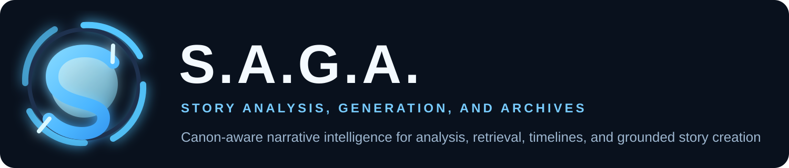

Production-oriented narrative intelligence system for extracting structured story knowledge from EPUB and PDF books, preserving canon, and preparing grounded inputs for future pre-canon, mid-canon, post-canon, and fanfiction authoring workflows.

The project ingests one or more books, splits them into scenes, analyzes each scene with LLM-backed extractors, and builds reusable narrative outputs such as:

- chapter rows
- scene analyses
- event ledger
- entity registry
- state transitions
- canon snapshots
- timeline events
- character timelines
- character profiles
- alias and identity decisions
- causal graph and metrics
- searchable story index

The main product surface is the Streamlit dashboard in [story_dashboard.py](/B:/Documents/PyCharm/graduationProject/story_dashboard.py).

## Main Features

- Unified series ingestion through EPUB and PDF processors
- Continuous target-word scene sizing with `0 = one full chapter per scene` (default)
- Cross-chapter chunk merging for nonzero target sizes
- Resumable per-book encode checkpoints for long-running series ingestion
- Optional Ollama Cloud API-key rotation after exhausted rate limits via a local ignored credential file
- Parallel scene analysis and identity analysis
- Local evidence extraction before LLM refinement
- Optional tool-first analysis mode with runtime-validated schema assembly
- Compare mode for structured vs tool-path validation
- Incremental alias-map updates during processing
- Deterministic downstream rebuilding after each scene
- Formal event ledger artifact for future divergence planning
- Formal character profile artifact built from identity, state, and timeline outputs
- JSON contract export from the dashboard
- Search across scenes, timeline, state, identities, and causal graph outputs

## Project Structure

- [story_dashboard.py](/B:/Documents/PyCharm/graduationProject/story_dashboard.py)
  Main Streamlit application.
- [services](/B:/Documents/PyCharm/graduationProject/services)
  Book ingestion and chapter extraction.
- [analysis](/B:/Documents/PyCharm/graduationProject/analysis)
  Scene splitting and per-scene LLM analysis.
- [entities](/B:/Documents/PyCharm/graduationProject/entities)
  Entity registry building.
- [state](/B:/Documents/PyCharm/graduationProject/state)
  State transitions and canon snapshots.
- [timeline](/B:/Documents/PyCharm/graduationProject/timeline)
  Timeline, character timeline, normalization, and causal graph services.
- [rag](/B:/Documents/PyCharm/graduationProject/rag)
  Searchable indexing services.
- [query](/B:/Documents/PyCharm/graduationProject/query)
  Story search/query services.
- [docs](/B:/Documents/PyCharm/graduationProject/docs)
  Project documentation.

## Running The Dashboard

From the project root:

```powershell
streamlit run story_dashboard.py
```

## Installation

Create a virtual environment, activate it, and install the project in editable mode:

```powershell
python -m venv venv
venv\Scripts\activate
pip install -e .[dev]
```

For the real persistent graph deployment, also install the optional Neo4j
dependency:

```powershell
pip install -e .[graph]
```

## What Changed

The current production branch adds the major persistence and generation stack
that was developed in the recent hardening work:

- Neo4j-backed persistent canon storage and inspection
- resumable `encode-store` ingestion with checkpoints and run status files
- direct Ollama Cloud API-key support and rotation
- hybrid graph + embedding retrieval for generation
- narrative generation for `pre_canon`, `mid_canon_insert`,
  `mid_canon_divergent`, and `post_canon`
- corpus audit, repair, rebuild, and model-comparison operator workflows
- Windows batch launchers for the main dashboard and CLI workflows

## Ollama API Keys

Ollama API keys and account rotation credentials are stored locally in:

- `deploy/ollama/accounts.local.json`

That file is git-ignored and should stay local to the machine.

Use this template when setting up a new machine:

- [deploy/ollama/accounts.local.example.json](/B:/Documents/PyCharm/graduationProject/deploy/ollama/accounts.local.example.json)

## Quick Start On Windows

If you want the easiest operator path on Windows, use the batch launchers in:

- [scripts/windows](/B:/Documents/PyCharm/graduationProject/scripts/windows)

Available launchers:

- [run_dashboard.bat](/B:/Documents/PyCharm/graduationProject/scripts/windows/run_dashboard.bat)
  Starts the Streamlit dashboard.
- [run_saga_tools.bat](/B:/Documents/PyCharm/graduationProject/scripts/windows/run_saga_tools.bat)
  Generic wrapper for any `saga_tools.py` command.
- [run_encode_store.bat](/B:/Documents/PyCharm/graduationProject/scripts/windows/run_encode_store.bat)
  Shortcut for `saga_tools.py encode-store`.
- [run_rebuild_corpus.bat](/B:/Documents/PyCharm/graduationProject/scripts/windows/run_rebuild_corpus.bat)
  Shortcut for `saga_tools.py rebuild-corpus`.
- [run_generate_sequel_neo4j.bat](/B:/Documents/PyCharm/graduationProject/scripts/windows/run_generate_sequel_neo4j.bat)
  Shortcut for `saga_tools.py generate-sequel-neo4j`.

Examples:

```powershell
scripts\windows\run_dashboard.bat

scripts\windows\run_saga_tools.bat inspect-corpus --series-id acotar

scripts\windows\run_encode_store.bat --book "D:\Books\Harry_Potter_Series\1 Harry Potter & the Philosophers Stone.epub" --series-id harry-potter --series-title "Harry Potter" --book-index-base 1

scripts\windows\run_rebuild_corpus.bat --series-id acotar --output-dir analysis_outputs\corpus_hardening\acotar_rebuild

scripts\windows\run_generate_sequel_neo4j.bat --series-id acotar --prompt "Continue from A Court of Silver Flames with Elain as the primary POV." --output-dir analysis_outputs\generated_narratives\acotar_book6
```

## Dashboard Workflow

1. Upload one or more EPUB or PDF books.
2. Choose:
   - scene analysis model
   - identity model
   - analysis mode
     - `structured` for the baseline path
     - `tool` for tool-validated schema assembly
     - `compare` to run both and inspect divergence
   - target scene size in words
     - `0` means one full chapter per scene and is the default processing mode
     - values above `0` can merge across chapter boundaries when needed
3. Click `Run Pipeline`.
4. Review outputs in the dashboard tabs.
5. Export the pipeline result using `Export JSON Contract` from the sidebar after the run completes.

## JSON Export

The dashboard can export a full JSON contract containing:

- run metadata
- inputs
- chapters
- scene analyses
- resolved scene analyses
- entity registry
- state result
- canon snapshot
- timeline
- character timelines
- identity result
- causal graph result
- story index summary

See [docs/JSON_CONTRACT.md](/B:/Documents/PyCharm/graduationProject/docs/JSON_CONTRACT.md) for the contract description.

## Persistent Encode / Decode Flow

The intended production flow is:

1. Encode books once with SAGA.
2. Persist the encoded narrative graph to Neo4j.
3. Reuse the stored graph for sequel retrieval and generation without
   reprocessing the source books each time.

Contract export remains available for debugging, portability, and reproducible
handoffs, but Neo4j is the preferred persistent memory layer for repeated
decoder workflows.

The permanent repo-managed Neo4j deployment lives in
[deploy/neo4j/compose.yaml](/B:/Documents/PyCharm/graduationProject/deploy/neo4j/compose.yaml).
Setup and operations are documented in
[docs/NEO4J.md](/B:/Documents/PyCharm/graduationProject/docs/NEO4J.md).

For multi-book series, use a stable `series_id`. That enables:

- retrieval from one specific book
- retrieval from a subset of books in the same series
- retrieval from the whole stored series corpus

It also enables incremental append. If you already encoded books 1-5 and book
6 releases later, you can encode only book 6 into the same `series_id`
without reprocessing the earlier books.

## Downstream Tools

After exporting a contract from the dashboard, you can run the downstream
database and sequel-generation adapters from the command line:

```powershell
# Create or update a corpus shell before first ingest
python saga_tools.py register-corpus --series-id harry-potter --series-title "Harry Potter" --uri bolt://localhost:7687 --username neo4j --password your-password --database neo4j

# Encode a series batch into one persistent corpus
python saga_tools.py encode-store --book hp1.epub --book hp2.epub --book hp3.epub --series-id harry-potter --series-title "Harry Potter" --book-index-base 1 --uri bolt://localhost:7687 --username neo4j --password your-password --database neo4j --out prepared_contract.json

# Later, append only a newly released book into the same series
python saga_tools.py encode-store --book hp6.epub --series-id harry-potter --series-title "Harry Potter" --book-index-base 6 --uri bolt://localhost:7687 --username neo4j --password your-password --database neo4j

# Inspect what is already persisted, including source hashes and ingest metadata
python saga_tools.py inspect-corpus --series-id harry-potter --uri bolt://localhost:7687 --username neo4j --password your-password --database neo4j

# Intentionally replace one persisted book if the source file changed
python saga_tools.py reencode-book --book hp6-revised.epub --series-id harry-potter --series-title "Harry Potter" --book-index-base 6 --uri bolt://localhost:7687 --username neo4j --password your-password --database neo4j

# Remove a bad ingest cleanly
python saga_tools.py remove-book --series-id harry-potter --book-title "Harry Potter and the Half-Blood Prince.epub" --uri bolt://localhost:7687 --username neo4j --password your-password --database neo4j

# Retrieve from the whole series
python saga_tools.py build-sequel-context-neo4j --series-id harry-potter --out sequel_context.json

# Retrieve from a subset of books in the same series
python saga_tools.py generate-blueprint-neo4j --series-id harry-potter --book-title "Harry Potter and the Goblet of Fire" --book-title "Harry Potter and the Order of the Phoenix" --prompt "Continue the strongest unresolved emotional arc." --out blueprint.json

# Retrieve from one specific stored book
python saga_tools.py generate-blueprint-neo4j --book-title "Harry Potter and the Half-Blood Prince" --prompt "Continue the strongest unresolved emotional arc." --out blueprint.json

# Contract-first fallback / debugging path
python saga_tools.py export-contract --contract saga_contract.json --out prepared_contract.json
python saga_tools.py probe-neo4j --uri bolt://localhost:7687 --username neo4j --password your-password --database neo4j
python saga_tools.py ingest-neo4j --contract prepared_contract.json
python saga_tools.py build-sequel-context --contract prepared_contract.json --out sequel_context.json
python saga_tools.py generate-blueprint --contract prepared_contract.json --prompt "Focus on Harry and Hermione growing closer." --out blueprint.json
```

Notes:

- `export-contract` validates and rewrites a dashboard-exported contract into a
  clean handoff file for downstream steps.
- `encode-store` is the main persistence command. It runs the encoder pipeline
  over one or more books and ingests the resulting contract into Neo4j in the
  same workflow.
- `encode-store` now executes book-by-book instead of holding a whole series in
  one long foreground transaction. That means completed books stay persisted
  even if a later book is interrupted.
- `encode-store` now performs a preflight plan against Neo4j before any heavy
  encoding work begins. It will:
  - skip unchanged books that already exist with the same source hash
  - block accidental stale overwrites by default
  - require `--replace-existing` or `reencode-book` for intentional replacement
- Every `encode-store` run writes:
  - a persistent run log
  - a `status.json` file
  - a `latest_status.json` pointer for the series
  - one contract artifact per completed book
- Those run artifacts live under:
  - `analysis_outputs/encode_runs/<series_id>/...`
- The status file is the operational source of truth for:
  - what finished
  - what failed
  - what was skipped
  - what remains pending
- `encode-store --series-id ... --book-index-base ...` is the supported way to
  append later books into an existing persisted series without re-encoding the
  older books.
- `register-corpus`, `inspect-corpus`, `reencode-book`, and `remove-book`
  provide the basic lifecycle surface for a persisted series.
- `build-sequel-context-neo4j`, `generate-blueprint-neo4j`, and
  `generate-sequel-neo4j` are the preferred repeated-generation path once a
  book has been encoded into the database.
- Persisted books store provenance metadata including source hash, source size,
  source modification time, encoder version, and model/config used at ingest
  time. That metadata is what powers duplicate detection and safe append flows.
- `ingest-neo4j` requires the optional graph dependency:

```powershell
pip install -e .[graph]
```

- Neo4j connection settings default to environment variables:
  - `NEO4J_URI`
  - `NEO4J_USERNAME`
  - `NEO4J_PASSWORD`
  - `NEO4J_DATABASE`
- `probe-neo4j` is the clean operator preflight for production environments.
  It verifies connectivity and configuration before any ingest attempt.
- `build-sequel-context` reuses `outputs.sequel_artifacts.context` by default
  when present in the contract. Use `--force-rebuild` to rebuild the narrative
  context from the core SAGA outputs instead.
- `generate-blueprint` reuses `outputs.sequel_artifacts.blueprint` by default
  when present in the contract. Use `--force-blueprint-regenerate` to generate
  a fresh blueprint, and `--force-context-rebuild` if you also want to rebuild
  the narrative context from core outputs.
- The dashboard narrative workspace is intentionally planning-only:
  narrative context and blueprint generation live in the UI, while full
  narrative generation remains a CLI/service workflow.

## Recommended Operator Workflows

### Full series ingest

```powershell
scripts\windows\run_encode_store.bat --book hp1.epub --book hp2.epub --series-id harry-potter --series-title "Harry Potter" --book-index-base 1 --uri bolt://localhost:7687 --username neo4j --password your-password --database neo4j
```

### Corpus hardening and rebuild

```powershell
scripts\windows\run_rebuild_corpus.bat --series-id acotar --output-dir analysis_outputs\corpus_hardening\acotar_rebuild --model-mode gpt_oss --ollama-model gemma4:31b-cloud
```

### Full Neo4j-backed generation

```powershell
scripts\windows\run_generate_sequel_neo4j.bat --series-id acotar --prompt "Generate an original sequel continuing the established canon storyline." --output-dir analysis_outputs\generated_narratives\acotar_book6 --chapters 10 --canon-position post_canon --primary-pov "Elain Archeron" --model-mode gpt_oss --ollama-model gemma4:31b-cloud
```

### Partial / diagnostic runs

```powershell
scripts\windows\run_saga_tools.bat audit-corpus --series-id acotar --out analysis_outputs\corpus_hardening\acotar_audit.json

scripts\windows\run_saga_tools.bat compare-generation-models --series-id acotar --prompt "Compare generation quality." --output-dir analysis_outputs\generated_narratives\acotar_compare
```

## Testing

The maintained regression coverage lives in [tests](/B:/Documents/PyCharm/graduationProject/tests).

Run the full suite:

```powershell
pytest tests
```

Run a single test module:

```powershell
pytest tests/test_scene_analyzer.py
```

## Documentation

- [docs/TARGET_SYSTEM.md](/B:/Documents/PyCharm/graduationProject/docs/TARGET_SYSTEM.md)
- [docs/ARCHITECTURE.md](/B:/Documents/PyCharm/graduationProject/docs/ARCHITECTURE.md)
- [docs/JSON_CONTRACT.md](/B:/Documents/PyCharm/graduationProject/docs/JSON_CONTRACT.md)
- [docs/NEO4J.md](/B:/Documents/PyCharm/graduationProject/docs/NEO4J.md)
- [docs/DASHBOARD.md](/B:/Documents/PyCharm/graduationProject/docs/DASHBOARD.md)
- [docs/TESTING.md](/B:/Documents/PyCharm/graduationProject/docs/TESTING.md)
