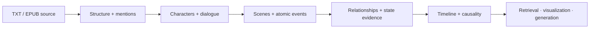
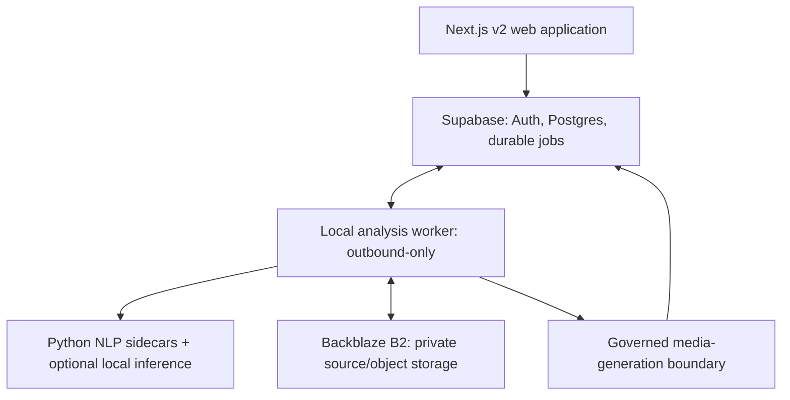

<h1 align="center">S.A.G.A.</h1>

<p align="center">
  <strong>Story Analysis, Generation, and Archives</strong><br />
  Turn novels and series into evidence-linked narrative intelligence: characters, dialogue, events, relationships, timelines, and canon.
</p>

<p align="center">
  <a href="https://studio-liard-omega.vercel.app">Hosted demo</a>
  · <a href="PROJECT.md">Development status</a>
  · <a href="docs/README.md">Documentation</a>
  · <a href="docs/v2/ANALYSIS_ARCHITECTURE_2026.md">Architecture</a>
  · <a href="CONTRIBUTING.md">Contributing</a>
</p>

<p align="center">
  <a href="https://github.com/faresmohamed260/saga/actions/workflows/backend-ci.yml"></a>
  <a href="https://github.com/faresmohamed260/saga/actions/workflows/v2-web-ci.yml"></a>
  
  
</p>

> **Status:** Active v2 development. The web/product foundation, private source ingestion, durable analysis control plane, and several measured narrative-analysis components are implemented. The complete v2 pipeline is **not yet production-ready end to end**. Phase 3 local-first narrative analysis is active. See [PROJECT.md](PROJECT.md) for the current handoff.

## What is S.A.G.A.?

S.A.G.A. is a narrative-intelligence platform for reverse-engineering books and series into a structured, evidence-linked model of the story.

Instead of treating a novel as one flat block of text, S.A.G.A. is designed to preserve the structure behind the narrative: canonical identities and mentions, dialogue and speakers, scenes and atomic events, relationships and character-state observations, narrative order, temporal evidence, and eventually causality, retrieval, visualization, and grounded generation.

Every derived observation should remain traceable to source evidence, provenance, uncertainty, and an explicit acceptance state.

## Why not just summarization or RAG?

A summarizer compresses prose. Conventional RAG retrieves passages. S.A.G.A. targets a different problem: **reconstructing narrative state while preserving the evidence that supports each interpretation**.

That means keeping source text immutable while allowing later evidence to change how mentions, speakers, events, relationships, or state candidates are resolved. Provider/model output is evidence; deterministic S.A.G.A. policy owns canonical identifiers, validation, persistence, and state transitions.

## Product goal


```mermaid
flowchart LR
    A["TXT / EPUB source"] --> B["Structure + mentions"]
    B --> C["Characters + dialogue"]
    C --> D["Scenes + atomic events"]
    D --> E["Relationships + state evidence"]
    E --> F["Timeline + causality"]
    F --> G["Retrieval · visualization · generation"]
```

A useful output is not just an answer. It is an answer plus the evidence trail that makes it auditable.

## Capability status

Status labels are deliberate:

- ✅ **Implemented / validated** — present in the active v2 repository and covered by current qualification.
- 🧪 **Evaluated challenger** — measured evidence exists, but the component is not a production default.
- 🚧 **Active** — current development/research work.
- 📋 **Planned** — later capability; not presented as shipped.

| Capability | Status | Current evidence / boundary |
| --- | --- | --- |
| Web accounts, invitations, and closed-demo surface | ✅ Implemented | Phase 1 complete |
| Private TXT/EPUB ingestion and normalized source persistence | ✅ Implemented | deterministic offsets, fingerprints, owner-scoped access |
| Durable jobs, leases, immutable runs, provenance, and evidence review foundations | ✅ Implemented | Supabase-backed control plane |
| Character identity | 🚧 Active | precision-first deterministic policy; unresolved/quarantined evidence preserved |
| Quote detection | ✅ Validated public candidate | deterministic P/R/F1 `0.8570 / 0.8555 / 0.8563` |
| Speaker attribution | 🧪 Evaluated challenger | combined deterministic-quote + BookNLP speaker V2; not a production default |
| Event triggers | 🧪 Evaluated challenger | BookNLP P/R/F1 `0.8003 / 0.7591 / 0.7791`; not adopted as production truth |
| Event participants and semantic qualifiers | 🧪 Evidence contracts | strict source-grounded evidence; coverage is not treated as correctness |
| Relationship observations | 🧪 Evidence contract | explicit observations only; no persistent relationship-state inference |
| Character life-state observations | 🧪 Evidence contract | narrow unverified candidate evidence only; no persistent/current state mutation |
| Narrative order and temporal cues | 🚧 Active | deterministic source order + unscoped temporal evidence; story-world time remains unresolved |
| Causality, arcs, canon retrieval, visualization, and grounded generation | 📋 Planned | later layers depend on a trustworthy evidence foundation |

Measured challengers are never silently promoted to defaults. The current decision ledger lives in the [component scorecard](docs/validation/PHASE_V2_3_COMPONENT_SCORECARD.md).

## Evidence model

S.A.G.A. keeps three conceptual layers separate:

1. **Source layer** — immutable text, sections, offsets, fingerprints, and exact evidence spans.
2. **Resolved layer** — identities, references, speakers, and confidence-gated interpretations.
3. **Derived intelligence layer** — events, relationships, state, chronology, causality, arcs, and higher-order narrative models.

A simplified evidence flow looks like this:

```text
source span
  -> candidate observation
  -> provider / rule provenance
  -> canonical references when safely resolved
  -> accepted / uncertain / rejected policy state
  -> downstream narrative intelligence
```

Later evidence may change interpretation without rewriting the source layer.

## Public evaluation snapshot

These numbers compare candidates evaluated inside S.A.G.A.'s public benchmark path. They are **not claims of state-of-the-art performance**, and public LitBank evidence alone is not sufficient for production adoption on modern fiction.

| Component | Candidate | Public evaluation | Precision | Recall | F1 / key result | Decision |
| --- | --- | --- | ---: | ---: | ---: | --- |
| Quote boundaries | Deterministic | LitBank/public gold | **0.8570** | 0.8555 | **0.8563 F1** | Retained as current measured leader among S.A.G.A. candidates |
| Quote boundaries | BookNLP-small | LitBank/public gold | 0.7706 | **0.8640** | 0.8146 F1 | Not selected for boundaries |
| Event triggers | BookNLP | LitBank/public gold | **0.8003** | **0.7591** | **0.7791 F1** | Strongest measured public trigger challenger; not production-adopted |
| Character identity | BookNLP-small | 100-document LitBank evaluation | 0.4613 canonical P | 0.6030 canonical R | 0.1934 incorrect merge | Rejected for primary identity |

For full definitions, failure modes, resource measurements, and adoption decisions, see [PROJECT.md](PROJECT.md), the [component scorecard](docs/validation/PHASE_V2_3_COMPONENT_SCORECARD.md), and [experiment records](docs/experiments/).

## Analysis strategy

Required text analysis follows a cost-aware, local-first evidence cascade:

1. **Tier 0 — deterministic structure and rules**
2. **Tier 1 — lightweight local literary NLP**
3. **Tier 2 — specialized local models for unresolved ambiguity**
4. **Tier 3 — small local generative reasoning over bounded evidence packets**

The required text-analysis path has no paid AI subscription/API dependency. Some retained integration packages support bounded or historical provider paths, but they are not a requirement for the locked local-first text-analysis strategy. Modal is reserved for governed image/media generation.

Full novels and multi-book series—not short demo chunks—are the target workload.

## Architecture


```mermaid
flowchart TB
    WEB["Next.js v2 web application"]
    SUPA["Supabase: Auth, Postgres, durable jobs"]
    WORKER["Local analysis worker: outbound-only"]
    NLP["Python NLP sidecars + optional local inference"]
    B2["Backblaze B2: private source/object storage"]
    MEDIA["Governed media-generation boundary"]

    WEB --> SUPA
    SUPA <--> WORKER
    WORKER --> NLP
    WORKER <--> B2
    WORKER --> MEDIA
    MEDIA --> SUPA
```

The browser never talks directly to a local model. Supabase owns durable queue truth so an offline worker can reconnect and resume. Backblaze B2 stores private binary/source objects behind a provider-neutral storage boundary.

## Technology

- **Backend and analysis:** Python 3.10+, FastAPI, SQLAlchemy, Alembic, LangGraph, pytest
- **Web:** Next.js 16, React 19, TypeScript, Tailwind CSS
- **Persistence:** Supabase PostgreSQL with owner/RLS boundaries
- **Object storage:** Backblaze B2 through an S3-compatible provider-neutral contract
- **Retrieval / graph options:** pgvector and Neo4j where current contracts adopt them
- **NLP evaluation:** deterministic analyzers, BookNLP experiments, LitBank/public corpora, protected modern-fiction qualification
- **Media:** separately governed ComfyUI/Modal integrations

## Development method

S.A.G.A. is contract-first and measurement-driven.

- Phase contracts are established before substantial implementation.
- State is labeled precisely: proposed, experimental, implemented, validated, or historical.
- Algorithms/providers are adopted through quality and resource evidence, not because a demo runs.
- Normal CI stays deterministic and model-light.
- Full-book and heavyweight benchmarks use dedicated qualification paths.
- Architecture, data ownership, authorization, retry behavior, validation, and provenance are explicit.
- Documentation should describe verified repository reality rather than duplicate volatile branch state.

## Quick start

### Prerequisites

- Python **3.10+**
- Node.js **24** and npm for `apps/web`
- Supabase and Backblaze B2 configuration for integration-dependent application paths
- Heavy literary-NLP/model assets only when running dedicated qualification workflows

### Python / model-light tests

Create an isolated environment and install development dependencies:

```bash
python -m venv .venv
python -m pip install --upgrade pip
python -m pip install -e ".[dev]"
pytest
```

Activate `.venv` using the command appropriate for your shell/OS before installing if your environment does not already target it.

### Web application

```bash
npm --prefix apps/web ci
npm --prefix apps/web run dev
```

Copy `apps/web/.env.example` to `apps/web/.env.local` and fill the required Supabase/B2 values for integration-dependent features. Do not commit secrets.

Run the same quality gates used by the web CI:

```bash
npm --prefix apps/web run lint
npm --prefix apps/web run typecheck
npm --prefix apps/web run test:unit
npm --prefix apps/web run build
```

The production build is designed to succeed without live provider credentials; integration-dependent features should fail only when invoked.

### Heavyweight qualification

Large NLP models, protected fiction corpora, and whole-book benchmarks are intentionally outside the default CI path. Follow the active phase contract and experiment documents before running model-backed qualification. Resource measurements are recorded alongside those experiments rather than presented as universal hardware minimums.

## Repository map

| Path | Status | Purpose |
| --- | --- | --- |
| `apps/web` | **Current v2** | Web product surface |
| `services/analysis-worker` | **Current v2** | Durable analysis orchestration and local-worker control plane |
| `packages` | **Current/shared** | Reusable runtime and domain packages |
| `integrations` | **Current/bounded** | Provider implementations behind explicit contracts |
| `migrations` / `supabase` | **Current v2** | Database evolution and hosted schema assets |
| `tests` | **Current v2** | Contract and behavior tests |
| `docs/v2` | **Current v2** | Architecture/runtime contracts |
| `docs/phases` | **Current v2** | Phase contracts and amendments |
| `docs/validation` | **Current v2** | Qualification state and component scorecards |
| `docs/experiments` | **Evidence** | Reproducible measurements and adoption/rejection records |
| `apps/dashboard_api` / `apps/dashboard_pro` | **Retained earlier surfaces** | Not the default surface for new v2 frontend work unless an active issue explicitly says otherwise |
| `backup/reference` | **Historical** | Isolated pre-v2 implementation/reference material; non-authoritative |

## Documentation hierarchy

Use one source for each kind of truth instead of reconstructing state from duplicated summaries:

1. [AGENTS.md](AGENTS.md) — repository/AI development instructions
2. [PROJECT.md](PROJECT.md) — **current project handoff and phase status**
3. [docs/README.md](docs/README.md) — documentation navigation
4. [docs/DECISIONS.md](docs/DECISIONS.md) — durable architectural/product decisions
5. Active material under [docs/phases](docs/phases/) — phase contracts
6. [docs/v2](docs/v2/) — current architecture/runtime contracts
7. [docs/validation](docs/validation/) — measured current component state
8. [docs/experiments](docs/experiments/) — detailed experiment evidence

Git history is definitive when checking whether a specific issue/PR/branch has merged; high-level docs intentionally avoid duplicating volatile commit checkpoints where possible.

## Roadmap

| Stage | Focus | Status |
| --- | --- | --- |
| Phase 1 | Closed-demo site, accounts, invitations | ✅ Complete |
| Phase 2 | Story intake + identity/application foundation | ✅ Repository foundation complete; original hosted-text-provider direction superseded |
| Phase 3 | Local-first narrative evidence: identity, dialogue, events, relationships, state, time | 🚧 Active |
| Later phases | Causality, arcs, canon retrieval, visualization, multimedia, grounded generation | 📋 Planned after evidence qualification |

No proposed layer is described as shipped until its active v2 contract is implemented and validated.

## Current limitations

- The complete v2 experience is not yet operational end to end.
- Story-world chronology/flashbacks are not inferred from temporal cues yet.
- Relationship and character-state evidence does not mutate persistent/current truth.
- Public corpus results do not replace protected modern-fiction product qualification.
- Causality, full arc modeling, canon-aware generation, and later visualization layers remain future work.

These are explicit boundaries, not hidden roadmap assumptions.

## Contributing

Start with [CONTRIBUTING.md](CONTRIBUTING.md), then read the current handoff and active phase contract before implementing substantial changes. New v2 frontend work belongs in `apps/web` unless an active issue states otherwise.

## License

S.A.G.A. is licensed under the [MIT License](LICENSE).
