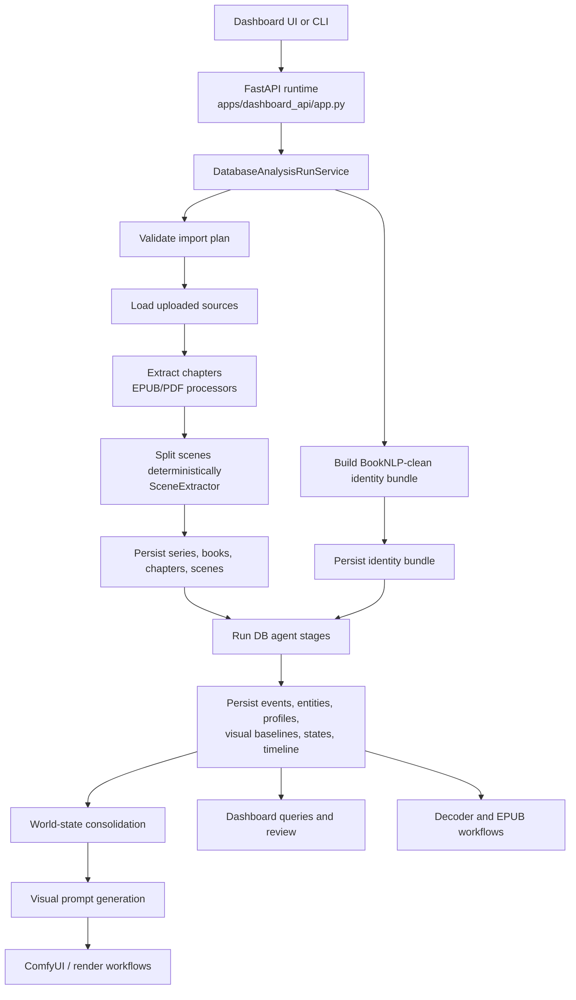
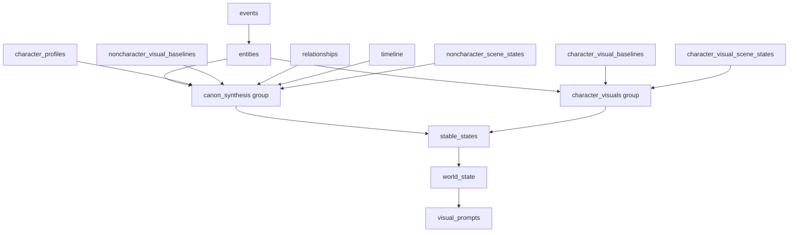
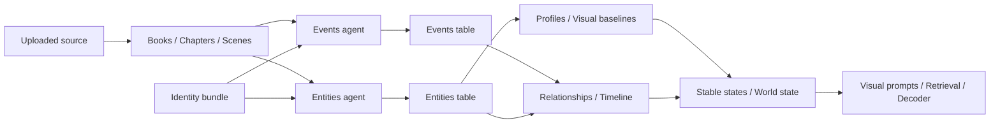

# S.A.G.A. Agent Pipeline And Dataflow

This document explains how the database-native agents work today, how they are orchestrated by the runtime, and how data moves from uploaded source books into durable SQLite artifacts, dashboard views, and downstream visual/decoder workflows.

## Why This Pipeline Exists

The active implementation is intentionally split into:

- deterministic preprocessing for ingestion, chapter extraction, and scene chunking
- provider-backed identity preparation before DB-agent analysis
- stage-based agents that each own one artifact family
- SQLite persistence as the system boundary between analysis and downstream use

That design keeps agent outputs inspectable, resumable, and reusable across the dashboard, visual prompt generation, and story generation flows.

## Main Runtime Components

### Entry Surfaces

- `apps/dashboard_api/app.py`
  Starts runtime jobs from HTTP endpoints and exposes stored results back to the UI.
- `apps/dashboard_pro`
  Operator UI for uploads, import planning, runs, diagnostics, visual assets, and review.
- `saga_tools.py`
  Headless and utility workflows outside the dashboard.

### Orchestration Layer

- `saga/services/database_analysis_run_service.py`
  Owns the database-native pipeline lifecycle: validate request, build identity bundle, ingest books, run stage groups, report progress, and enforce stage gates.

### Deterministic Preprocessing

- `saga/services/epub_processor.py`
- `saga/services/pdf_processor.py`
- `saga/agents/scene_extractor.py`

These modules normalize source books into chapters and split them into deterministic scene-sized chunks before agent analysis begins.

### Identity Layer

- `saga/identity/series_identity_provider.py`
- `saga/identity/booknlp_identity_adapter.py`
- `saga/identity/identity_provider.py`

This layer builds the provider-backed identity bundle used to anchor canonical character names, aliases, narrator handling, and reference entities before the main agent stages run.

### Agent Layer

The current DB-native run service orchestrates these stage owners:

- `DatabaseEventAnalysisAgent`
- `DatabaseEntityDiscoveryAgent`
- `DatabaseCharacterProfileAgent`
- `DatabaseCharacterVisualBaselineAgent`
- `DatabaseNonCharacterVisualBaselineAgent`
- `DatabaseCharacterVisualSceneStateAgent`
- `DatabaseNonCharacterSceneStateAgent`
- `DatabaseRelationshipAgent`
- `DatabaseTimelineAgent`
- `DatabaseStableCharacterStateAgent`
- `DatabaseWorldStateConsolidationAgent`

### Persistence And Downstream Services

- `saga/storage/persistence.py`
- `saga/services/entity_visual_prompt_service.py`
- `saga/services/database_decoder_service.py`
- `saga/services/generated_story_epub_service.py`

SQLite is the durable handoff layer. Once agent artifacts are stored, they can be queried, reviewed, transformed into prompts, or reused by decoder/export workflows without rerunning ingestion.

## End-To-End Flow

## Stage Orchestration

`DatabaseAnalysisRunService` defines a default stage order and groups some stages into parallel batches where dependencies allow it.

### Default Stage Sequence

1. `events`
2. `entities`
3. `character_profiles`
4. `character_visual_baselines`
5. `noncharacter_visual_baselines`
6. `character_visual_scene_states`
7. `noncharacter_scene_states`
8. `relationships`
9. `timeline`
10. `stable_states`
11. `world_state`
12. `visual_prompts`

### Stage Groups Used By The Runtime

### Gatekeeping Rules

Two early stages are treated as hard gates:

- `events` must persist at least one event
- `entities` must persist at least one entity or update an existing one

If either stage produces no usable output, the run service blocks downstream stages instead of silently building thin artifacts on empty inputs.

## Detailed Dataflow

### 1. Uploads And Import Plan

The dashboard API stores uploaded sources, then validates an import plan before any long-running work starts. The plan carries:

- series metadata
- selected source files
- per-book order and titles
- shared runtime configuration
- optional resume information

Jobs are tracked in SQLite as dashboard jobs, with structured logs and progress payloads written throughout the run.

### 2. Ingestion And Scene Creation

Each selected source is normalized into chapters, then `SceneExtractor` turns chapter text into deterministic scene chunks. Those scene rows are persisted before agent analysis starts, which means later stages operate on stable DB-backed chapter and scene records rather than transient in-memory contracts.

### 3. Identity Bundle Build

If the configured identity provider is `booknlp_clean`, the run service builds per-book identity summaries first, then merges them into a series identity payload. That payload is persisted and reused on resumed runs.

Identity contributes:

- canonical character names
- alias index
- narrator information
- reference entities
- provider-locking behavior that reduces scene-local identity drift

### 4. Agent Execution Against SQLite

After ingestion, each stage reads previously persisted rows and writes its own artifact family back into SQLite.

## What Each Agent Produces

| Stage | Main input(s) | Main output(s) | Why downstream stages need it |
| --- | --- | --- | --- |
| `events` | scenes, identity context, LLM client | event rows | timeline, causality, profiles, state reconstruction |
| `entities` | scenes, identity context, LLM client | canonical entity rows | profiles, visuals, prompts, world state |
| `character_profiles` | entity set, event context, LLM client | character profile rows | dashboard review, decoder grounding |
| `character_visual_baselines` | character entities, scene evidence, LLM client | first-appearance character visual baselines | render-safe character prompts |
| `noncharacter_visual_baselines` | non-character entities, scene evidence, LLM client | object/creature/location visual baselines | non-character prompt generation |
| `character_visual_scene_states` | scenes, characters, LLM client | scene-level visual state changes | continuity-aware visual outputs |
| `noncharacter_scene_states` | scenes, entities | non-character scene state rows | location/object/creature continuity |
| `relationships` | events, entities, scenes | relationship change rows | social state and profile synthesis |
| `timeline` | events, scenes, relationships | ordered timeline rows | story navigation and later causality work |
| `stable_states` | timeline, profiles, state changes | stable character state rows | point-in-time reconstruction |
| `world_state` | visual baselines, scene states, stable states | consolidated world state | prompt generation and retrieval |
| `visual_prompts` | entities plus visual baselines/world state | stored visual prompt rows | image generation workflows |

## Tool-Constrained Extraction Inside The Agents

Some earlier pipeline logic still exists as reusable building blocks for structured extraction and normalization, especially around scene analysis.

- `saga/agents/tool_runtime.py` provides a schema enforcement boundary for tool-mode scene analysis.
- The LLM emits tool calls instead of free-form final JSON.
- `SceneToolRuntime` validates, deduplicates, and normalizes those calls into stable fields such as events, mentions, state changes, and relationship changes.

That pattern matters because it shows the repo's broader direction: use LLMs for bounded judgment, then let deterministic code own the final schema.

## Microtasks

The microtask registry in `saga/agents/microtasks/task_registry.py` defines bounded semantic tasks and their preferred local models. These are smaller review/classification units used to keep specific judgments narrow, such as:

- candidate validation
- alias merge scoring
- event significance ranking
- relationship change classification

They are not the top-level pipeline, but they are part of the internal agent toolbox that keeps larger analysis stages from becoming one giant opaque prompt.

## Runtime Concerns: Retry, Resume, Parallelism

The run service includes several operational behaviors that are important to understand when integrating new agents:

- progress is persisted as structured dashboard job state
- failed runs can resume from existing identity bundles, books, and completed stages
- chapter-level stages use timeouts and retry-aware LLM clients
- some stage groups run in parallel with a bounded worker count
- job cancellation is cooperative and checked between stages and chapters

This makes the pipeline behave more like a resumable workflow engine than a single script.

## SQLite As The Contract Boundary

The pipeline is now DB-native. In practice that means the real contract between pipeline phases is not a loose filesystem JSON blob but persisted SQLite rows.

This gives the system:

- resumability
- inspectability from the dashboard
- deterministic downstream reuse
- easier stage-level replacement or extension
- less coupling between analysis-time prompts and consumer-time features

## Integration Points For Downstream Features

### Dashboard

The dashboard reads the stored run, book, scene, event, entity, profile, timeline, state, image, and prompt records to let an operator inspect quality and progress without rerunning the pipeline.

### Visual Generation

`EntityVisualPromptService` compiles durable prompt rows from entity records plus visual baselines and world state. Those prompts can then feed ComfyUI or related render integrations.

### Decoder / Story Workflows

The decoder layer and EPUB generation services consume persisted canon artifacts rather than raw scene-analysis payloads. That keeps generation grounded in the same canonical memory visible in the dashboard.

## Practical Integration Guidance For New Agents

If you add a new agent to this pipeline, the least disruptive path is:

1. define one clear artifact family and its owning table(s)
2. make the agent read stable upstream SQLite rows, not ad hoc in-memory payloads
3. add the stage to `DEFAULT_AGENT_STAGES`
4. place it into a stage group only if its dependencies are already persisted
5. enforce a stage gate if downstream stages would become misleading on empty output
6. expose the result through dashboard queries only after persistence is stable

## Summary

The current S.A.G.A. pipeline is a database-native, stage-oriented workflow:

- deterministic ingestion creates stable chapters and scenes
- identity is prepared up front and persisted
- agents run as bounded artifact builders
- SQLite is the handoff boundary between stages
- dashboard, visual, and decoder workflows all integrate by reading the same stored canon artifacts

That shared storage model is what lets the agents participate in one coherent pipeline instead of acting like disconnected scripts.
